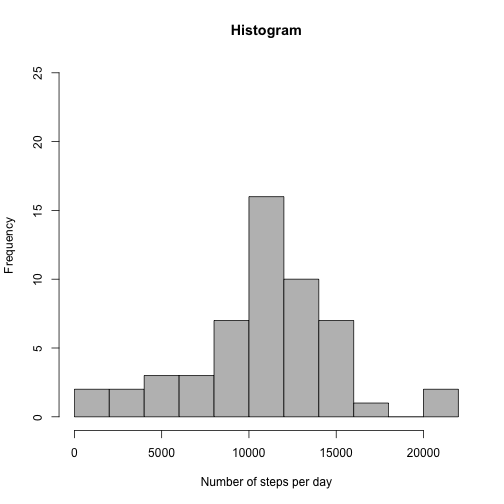
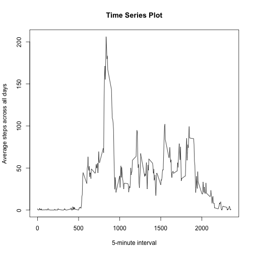
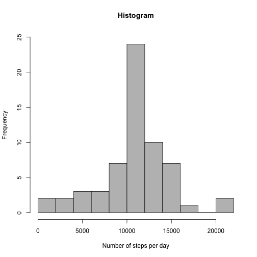
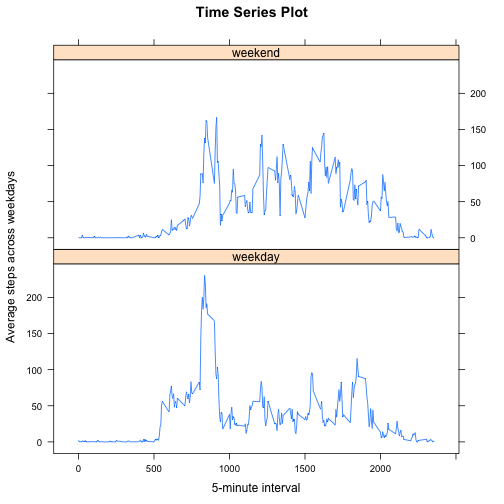

Assignment Week 2 of Reproducible Research
==========================================


## Assumption
- The Data is taken from the GitHub Repo and stored in a .zip file
- The Data is stored in parent directory

## Loading and preprocessing the data

Unzip File and load data.


```r
unzip("activity.zip")

data <- read.csv("activity.csv")
```


## What is mean total number of steps taken per day?

For this part of the assignment, we can ignore the missing values in the dataset.

### 1. Calculate the total number of steps taken per day

We only display the first 5 days, since we have 53 days in the data, which would make the output tedious.


```r
StepsPerDay <- aggregate(steps ~ date, data=data, FUN=sum, na.action=na.omit)
head(StepsPerDay)
```

```
##         date steps
## 1 2012-10-02   126
## 2 2012-10-03 11352
## 3 2012-10-04 12116
## 4 2012-10-05 13294
## 5 2012-10-06 15420
## 6 2012-10-07 11015
```

### 2. Make a histogram of the total number of steps taken each day.


```r
hist(StepsPerDay$steps, 
     col="grey",
     breaks=10,
     main="Histogram",
     xlab="Number of steps per day",
     ylim=c(0,25))
```



### 3. Calculate and report the mean and median of the total number of steps taken per day.


```r
# Mean of the total number of steps taken per day
mean(StepsPerDay$steps)
```

```
## [1] 10766.19
```

```r
# Median of the total number of steps taken per day
median(StepsPerDay$steps)
```

```
## [1] 10765
```


## What is the average daily activity pattern?

### 1. Make a time series plot

Make a time series plot (i.e. type="l") of the 5-minute interval (x-axis) and the average number of steps taken, averaged across all days (y-axis).

Prepare the data.


```r
StepsPerInterval <- aggregate(steps ~ interval, data=data, FUN=mean, na.action=na.omit)
```

Plot tim series.


```r
plot(x=StepsPerInterval$interval, y=StepsPerInterval$steps,
     type="l",
     main="Time Series Plot",
     xlab="5-minute interval",
     ylab="Average steps across all days")
```



### 2. Find 5-minute interval with maximum number of steps

Which 5-minute interval, on average across all the days in the dataset, contains the maximum number of steps?


```r
StepsPerInterval[StepsPerInterval$steps==max(StepsPerInterval$steps),]
```

```
##     interval    steps
## 104      835 206.1698
```


## Imputing missing values

### 1. Report number of missing values

Calculate and report the total number of missing values in the dataset (i.e. the total number of rows with NAs).


```r
# First we check the total number of missings in the data set.
table(is.na(data))
```

```
## 
## FALSE  TRUE 
## 50400  2304
```

```r
# Second we check the total number of missings for the varaibel 'steps'.
table(is.na(data$steps))
```

```
## 
## FALSE  TRUE 
## 15264  2304
```

The total number of rows with NAs = 2304.
If the two checks above would have delivered different results, we also have had missing values in at least one of the two other variables. This was, however, not the case.

### 2. Strategy to replace missing values

Devise a strategy for filling in all of the missing values in the dataset. The strategy does not need to be sophisticated. For example, you could use the mean/median for that day, or the mean for that 5-minute interval, etc.

I opt for using the mean for the 5-minute interval. The mean since we have metric data.

### 3. Create a new dataset that is equal to the original dataset but with the missing data filled in

First, merge original data set with 'StepsPerInterval' data by variable 'interval'. Specifying all.y=F makes sure we keep all observations from 'data'.


```r
dataCorrected <- merge(data, StepsPerInterval, by="interval", all.x=T, all.y=F)
```

Second, replace missing values only with appropriate mean values.


```r
dataCorrected$steps.x[is.na(dataCorrected$steps.x)] <- dataCorrected$steps.y[is.na(dataCorrected$steps.x)]
```

Third, rename variable 'steps.x' and delete variable 'steps.y'.


```r
names(dataCorrected)[names(dataCorrected)=="steps.x"] <- "steps"

dataCorrected$steps.y <- NULL
```

Fourth, reorder columns and variables to match original data frame.


```r
dataCorrected <- dataCorrected[c("steps", "date", "interval")]

dataCorrected <- dataCorrected[order(dataCorrected$date, dataCorrected$interval),]
```


### 4. Make a histogram of the new data and calculate mean and median

Make a histogram of the total number of steps taken each day and Calculate and report the mean and median total number of steps taken per day. Do these values differ from the estimates from the first part of the assignment? What is the impact of imputing missing data on the estimates of the total daily number of steps?

Prepare data for histogram.


```r
StepsPerDayCorrected <- aggregate(steps ~ date, data=dataCorrected, FUN=sum)
```

Build histogrm.


```r
hist(StepsPerDayCorrected$steps, 
     col="grey",
     breaks=10,
     main="Histogram",
     xlab="Number of steps per day",
     ylim=c(0,25))
```



Calculate mean and median of the data.


```r
# Mean of the total number of steps taken per day
mean(StepsPerDayCorrected$steps)
```

```
## [1] 10766.19
```

```r
# Median of the total number of steps taken per day
median(StepsPerDayCorrected$steps)
```

```
## [1] 10766.19
```

The mean, naturally, stays the same. The median is slighly (1.19) lower than before. The higher frequency of the mean value is also clearly visible in the histogram.


## Are there differences in activity patterns between weekdays and weekends?

Use the dataset with the filled-in missing values for this part.

### 1. Create a new factor variable indicating weekday and weekend

Create a new factor variable in the dataset with two levels – “weekday” and “weekend” indicating whether a given date is a weekday or weekend day.

The new variable will be called 'day'.


```r
# Make sure we use English as system language for getting the English names of days from weekdays function.
Sys.setlocale("LC_TIME", "C")
```

```
## [1] "C"
```

```r
# Add new variable with missings
dataCorrected$day <- NA

# Mark weekdays
dataCorrected$day[weekdays(as.Date(dataCorrected$date)) %in% c("Monday", "Tuesday", "Wednesday", "Thursday", "Friday")] <- "weekday"

# Mark weekend
dataCorrected$day[weekdays(as.Date(dataCorrected$date)) %in% c("Saturday", "Sunday")] <- "weekend"

# Turn variable 'day' into factor variable
dataCorrected$day <- as.factor(dataCorrected$day)
```

### 2. Make a panel plot containing a time series plot

Make a panel plot containing a time series plot (i.e. type="l") of the 5-minute interval (x-axis) and the average number of steps taken, averaged across all weekday days or weekend days (y-axis). See the README file in the GitHub repository to see an example of what this plot should look like using simulated data.

Prepare the data.


```r
StepsPerIntervalCorrected <- aggregate(steps ~ interval + day, data=dataCorrected, FUN=mean)
```

Plot tim series as panel plot.


```r
library(lattice)

xyplot(steps ~ interval | day,
       data=StepsPerIntervalCorrected,
       type="l",
       layout=c(1,2),
       xlab="5-minute interval",
       ylab="Average steps across weekdays",
       main="Time Series Plot")
```




